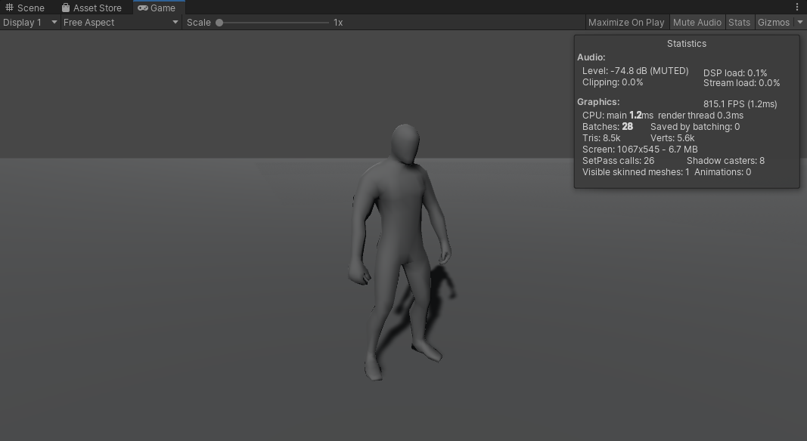
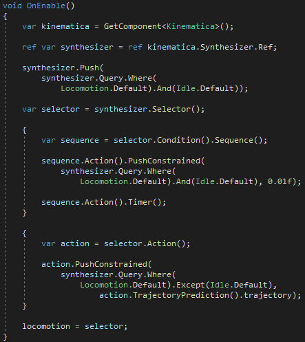
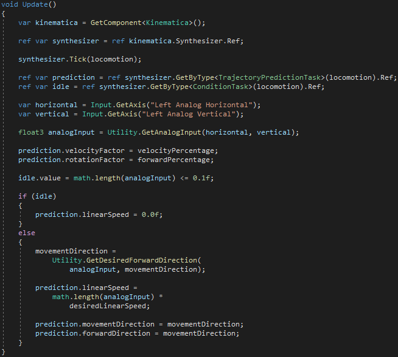

# Getting Started with Kinematica

The Kinematica package contains a number of sample projects that serve as a starting point to understand the concepts and the workflow.

The individual sample projects can be directly installed from the Package Manager. Click the `Import into project` button next to a sample project.

The `Biped Locomotion` sample contains a simple locomotion setup for a bipedal player controlled character.

Load the `Biped` scene from the `Biped Locomotion` sample project.

Now open the Kinematica Asset Builder window (Window -> Animation -> Kinematica Asset Builder) and select the `Biped` Kinematica asset. The Asset Builder is the central tool in Unity that allows the creation and modification of the Kinematica motion library. It also offers debug functionality in Play Mode to visually inspect Kinematica's runtime components.

The Kinematica Asset Builder is described in detail in the [Asset Builder](Builder.md) section.

Kinematica deviates from the usual way of handling assets in Unity. The motion library asset needs to be built before it can be used in play mode. The build step pre-processes the referenced animation clips and generates a memory-ready binary runtime-only asset. The Kinematica asset builder allows to build the runtime asset from the editor asset.

Click the `Build` button in the upper right corner of the Kinematica Asset Builder window to build the runtime asset from the editor project. This build process will take anywhere from a couple of seconds to a couple of minutes depending on the amount of animation data contained in the project.

Once this build step of the runtime-asset has been completed, enter play mode.

The character can be controlled by using the WASD keys or by using a gamepad.

Selecting the `Biped` game object in the hierarchy window will show the components that are used in this sample setup.

The `Kinematica` component is the central part of this setup that contains the motion synthesizer. It references the asset that we built in the previous step and drives the frame-by-frame generation of animation poses.

The `Biped` component is a simple MonoBehavior script that contains the game code for this sample.

The image above shows the `OnEnable()` method that is used in the `Biped` script. Kinematica uses the notion of a task graph to segregate the actual frame-by-frame processing from the controlling game code. The benefit is that the code that decides how to animate the character always runs on its dedicated job inside Kinematica. It also allows for a very concise and standardized API syntax. Another benefit of this segregation is that the controlling game code can either execute as a MonoBehavior or as a Burst compiled C# job. No modifications would be required to move the code from a MonoBehavior into a job.

In the code snippet shown above, we generate a task graph that handles the default locomotion movement in addition to the ability to play a specific idle animation in case no movement has been requested.

Further information regarding the task graph setup and Kinematica's semantic query language can be found in the [Task Graph](Task-Graph.md) and [Query Language](Query-Language.md) sections respectively.

The image above shows the `Update()` method that is used in the `Biped` script. Here we read the keyboard/gamepad input and forward the resulting movement/facing direction to the corresponding nodes in the task graph. The actual frame-by-frame processing takes when the task graph executes later this frame.

There are some obvious similarities to traditional animation graphs here at a first glance. The difference is that the code that executes as part of a Kinematica task graph is completely user defined. The reason why we chose to employ a task based system is to ensure that Kinematica's code always executes as Burst compiled code inside of a job.

A much more elaborate example project that shows various different character abilities can be found [here](https://github.com/Unity-Technologies/Kinematica).

Task graphs can be visualized and serve as a debugging tool. Kinematica's task graph window can be opened via `Window -> Animation -> Kinematica Task Graph`. The image above shows the contents of the task graph window for the Biped sample.

This visualization is displays the current task graph setup on a frame-by-frame basis for the currently selected game object. It is automatically generated based on the game code as it modifies the task graph.

A detailed description of the task graph infrastructure can be found in the [Task Graph](Task-Graph.md) section.

Further information regarding Kinematica can be found in the [Kinematica concepts and overview](Overview.md) section of this documentation.
