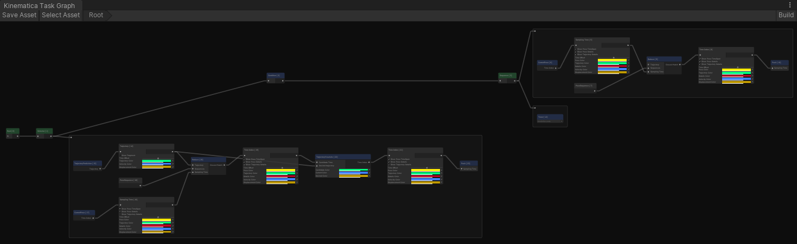

# Kinematica Task Graph

Each frame Kinematica tries to filter the entire set of animation poses contained in the motion library down to a single pose. This process is outlined in the [Query Language](Query-Language.md) sections.

The last step of this filtering process, after the entire set of possible animation poses has been reduced to the set of poses that match certain semantic criteria, is to reduce the subset down to a single pose. This process can be performed in a number of ways, one of them being to use pose and/or trajectory matching subject to their respective constraints.



Kinematica uses a task based system for the last step of the filtering and reduction process. Tasks always execute in their own job prior to the frame update of Kinematica itself, regardless of where (main thread or job) and when the task graph has been updated during a frame. The task graph is meant to be changed on a frame-by-frame basis and the controlling logic can build a new task graph on an as-needed basis.

The motion synthesizer offers a number of frequently used tasks and several convenience methods to easily chain tasks. In addition, users can define their own custom tasks in order to control Kinematica's motion synthesizer.

In the above image, green nodes represent control flow tasks, group nodes represent tasks that execute as a statement and are evaluated from left to right, and blue nodes represent actual task operations.

## Pre-Defined and Custom Tasks

The following is a list of pre-defined tasks:

* Actions - Grouper nodes for sequential statement
* Sequence, Selector, Parallel - Control flow tasks similar to nodes that would be used in a behavior tree
* Trajectory Prediction, Current Pose, Reduce, Push - Task operations that either process data or modify the synthesizer state

Task graphs can be conveniently constructed like this:

```
var kinematica = GetComponent<Kinematica>();

ref var synthesizer = ref kinematica.Synthesizer.Ref;

var action = selector.Action();

this.trajectory = action.Trajectory();

action.PushConstrained(
    synthesizer.Query.Where(
        Locomotion.Default).Except(Idle.Default),
            this.trajectory);
```

This example uses the task graph API which is offered by the motion synthesizer. Please refer to the documentation of the motion synthesizer for a detailed explanation of the available methods.

Users can easily define new tasks in a script:

```
[Data("ExampleTask", "#2A3756"), BurstCompile]
public struct ExampleTask : Task
{
    internal MemoryRef<MotionSynthesizer> synthesizer;

    public Result Execute()
    {
        return Result.Success;
    }
}
```

And create an instance of this task like this:

```
var kinematica = GetComponent<Kinematica>();

ref var synthesizer = ref kinematica.Synthesizer.Ref;

var identifier = synthesizer.Allocate(new ExampleTask());
```

Each task (and data that a task operates on) is referred to by an identifier which is the result of a call to `synthesizer.Allocate()`. This identifier represents a handle to the task in order to retrieve access to the task or manipulate the task graph.

## Task Inputs and Outputs

Tasks can have an arbitrary number of input and output parameters. Here is an example taken from the `ReduceTask`:

```
[Input("Trajectory")]
internal Identifier<Trajectory> trajectory;

[Input("Sequences")]
internal Identifier<PoseSequence> sequences;

[Input("Sampling Time")]
internal Identifier<SamplingTime> samplingTime;

[Output("Closest Match")]
internal Identifier<TimeIndex> closestMatch;
```

The reduce task has 3 inputs (trajectory, sequences, sampling time) and 1 output parameter (closest match). These references to data are also represented by using an identifier.

Data that is to be used as task input/output parameters can be defined like this:

```
[Data("ExampleData")]
public struct ExampleData
{
    ...
}
```

Data has to be allocated just like tasks, then identifiers have to be set in order for the task to refer to the data it is supposed to interact with. Kinematica's task system is very open ended and has full access to the runtime asset and the motion syntheszier. The pre-defined tasks that the motion synthesizer API offers serve as an example of frequently used tasks.

## Task Nodes Life Cycle

It should be noted that it is perfectly valid to create task graph nodes (tasks or data) on the main thread (MonoBehavior), inside a C# (burst compiled) job or inside a task itself.

Allocated nodes in the task graph are by default only valid during the frame that they were created in. The controlling logic has to communicate the fact that a node (or a whole sub graph) is to be kept alive over the course of its lifespan. The rationale behind this is the fact that game logic should be able to switch instantenously between logical states (for example transition between locomotion and climbing). There is no "cleanup" required when switching from one state to another, but a requirement is to tell Kinematica that a portion of the task graph should be kept alive. This process is called "Ticking" and the motion synthesizer offeres a variety of methods to tick individual nodes or portions of the task graph. If a task graph node does not receive a tick signal in a given frame, it will be automatically removed.

## Task Graph Window

The task graph window can be accessed via `Window -> Animation -> Kinematica Task Graph`. It displays during play mode continuously the current state of the task graph of the currently selected game object. In combination with Kinematica's snapshot debugger this becomes a powerful debugging tool.

Nodes in the task graph are also user defined (similar to custom inspectors) and display relevant contextual information. For example, selecting the `CurrentPoseTask` displays the current motion synthesizer pose alongside with a number of relevant information in the scene view as well as highlights the corresponding pose in the Builder Window.

Custom Task Graph Nodes can be defined like in this example:

```
using Unity.Kinematica.Editor;

[GraphNode(typeof(ExampleTask))]
public class ExampleTaskNode : GraphNode
{
    public override void OnSelected(ref MotionSynthesizer synthesizer)
    {
    }
}
```
